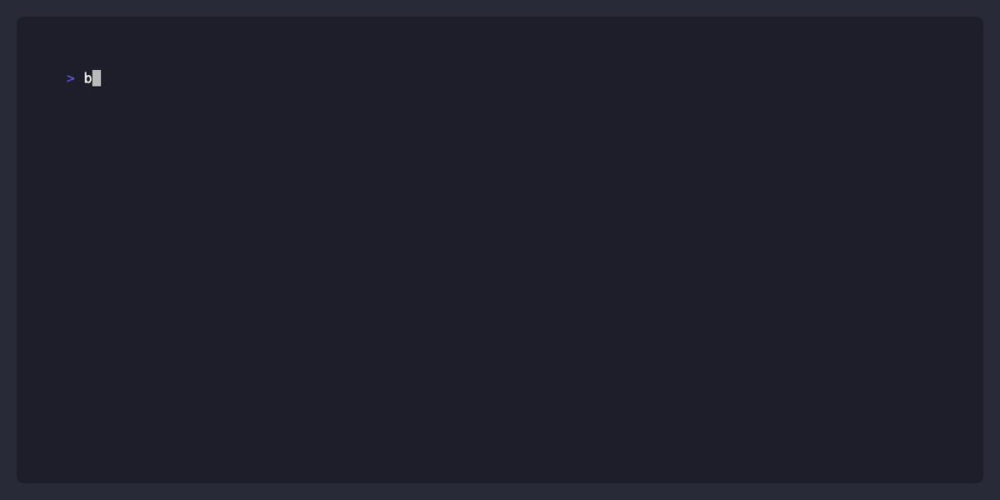

# brtc

**Stop guessing password strength. Calculate the actual bill.**

[](https://github.com/kanywst/brtc/actions)
[](https://goreportcard.com/report/github.com/kanywst/brtc)

---

**brtc (Brute-force Cost)** is a CLI tool that translates abstract concepts like "entropy" into harsh reality: **exactly how much time and cloud infrastructure money it takes to crack a password.**

Instead of just telling you a password is "Weak" or "Strong", `brtc` pits your string against an RTX 4090 rig or an AWS 8x H100 cluster running `bcrypt`, and gives you the receipt.

## Demo



## Features

- **Financial Cost Visualization:** Uses current spot prices for AWS or GPU providers to calculate the total USD cost to crack your hash.
- **Hardware Simulation:** Select between `rtx-4090`, `cpu-standard`, or `aws-p5.48xlarge` profiles to see how hardware scales the threat.
- **Hash Algorithms:** Simulates the braking power of `md5`, `sha256`, `bcrypt`, and `argon2id` with adjustable work factors.
- **Terminal UI:** Beautiful, animated proportional output built on [Bubble Tea](https://github.com/charmbracelet/bubbletea) and Lipgloss.
- **CI/CD Gatekeeper:** Use the `--fail-under-time` flag in your pipelines to break the build if a secret can be cracked faster than your threshold (e.g., `1y`, `30d`). Also supports standard `json` and `sarif` outputs for tooling.

## Installation

Assuming you have Go 1.25+ installed:

```bash
go install github.com/kanywst/brtc@latest
```

## Usage

Just pass the password as an argument:

```bash
brtc "P@ssw0rd123!"
```

Or pipe it in:

```bash
echo "P@ssw0rd123!" | brtc
```

### Options

| Flag                | Default    | Description                                                                                |
| ------------------- | ---------- | ------------------------------------------------------------------------------------------ |
| `--hw`              | `rtx-4090` | The attacker's hardware profile (`rtx-4090`, `cpu-standard`, `aws-p5.48xlarge`)            |
| `--algo`            | `bcrypt`   | The target hash algorithm (`md5`, `sha256`, `bcrypt`, `argon2id`)                          |
| `--cost`            | `10`       | The work factor / cost applied to algorithms like bcrypt                                   |
| `--budget`          | `""`       | Set an attacker budget (e.g. `1000usd`) to see the max characters they can afford to crack |
| `--output`, `-o`    | `tui`      | Output format (`tui`, `json`, `sarif`)                                                     |
| `--fail-under-time` | `""`       | CI/CD threshold to fail the run (e.g., `1y`, `30d`, `12h`)                                 |

### Example Outputs

#### Beautiful TUI

```bash
brtc --algo bcrypt --cost 12 --hw aws-p5.48xlarge "shortpass"
```

#### JSON for Automation

```bash
brtc -o json "P@ssw0rd123!" | jq .
```

#### CI Gatekeeper Example

```bash
brtc --fail-under-time 1m "short"
# Error: gatekeeper failed: estimated crack time (31.7 minutes) is less than required (1.0 months)
# Exit code 1
```

## Development

Standard Go toolchain layout:

```bash
make test      # Run all tests
make lint      # Run golangci-lint
make format    # go fmt & go mod tidy
make vuln      # Check for known vulnerabilities via govulncheck
make build     # Build the binary directly
```

## License

MIT
