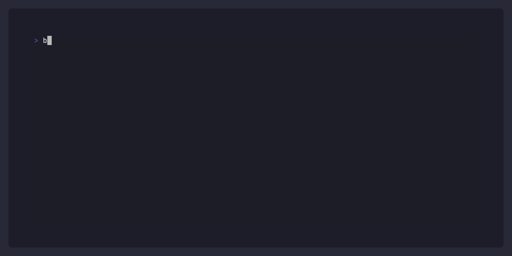
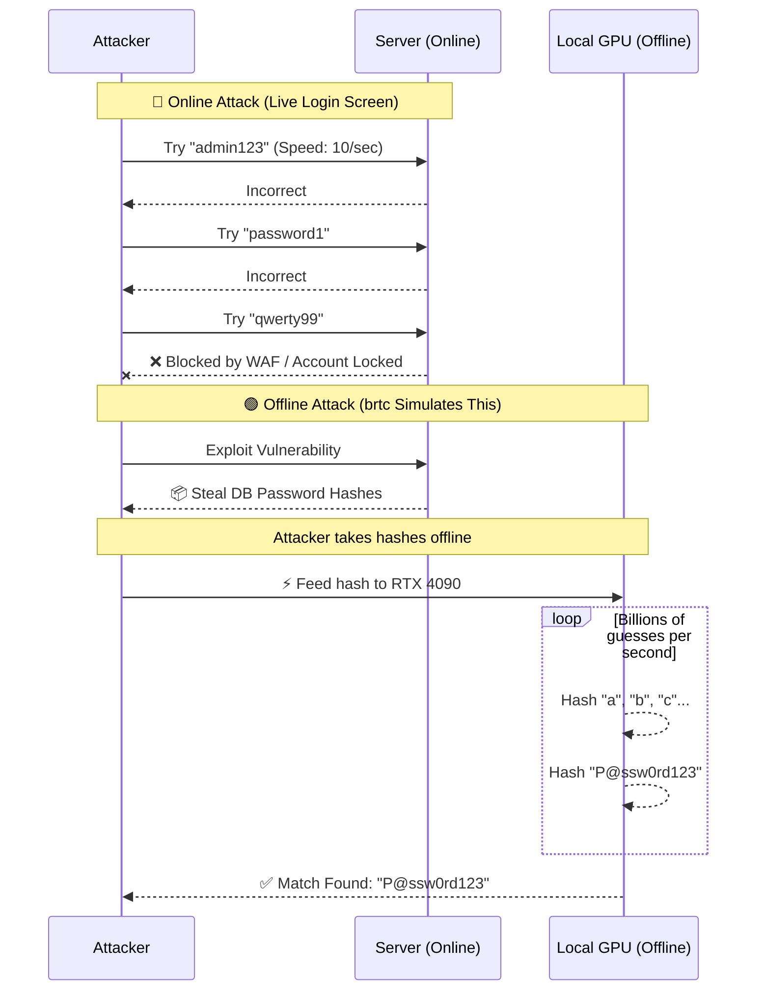

# brtc

**Stop guessing password strength. Calculate the actual bill.**

[](https://github.com/kanywst/brtc/actions)
[](https://goreportcard.com/report/github.com/kanywst/brtc)

---

> **brtc is a cost calculator, not a strength meter.**
> It converts an entropy/guess count into an offline-attack price tag in USD against a chosen GPU or cloud profile.
> It does **not** detect dictionary words, leetspeak, keyboard walks, or other patterns — `P@ssw0rd!` looks "strong" by raw entropy alone but is trivially guessable in practice.
> For real-world strength evaluation, **pair brtc with [zxcvbn](https://github.com/dropbox/zxcvbn)** (or [zxcvbn-ts](https://github.com/zxcvbn-ts/zxcvbn)) and feed its `guesses` value into brtc via `--guesses` (coming in a follow-up release).

**brtc (Brute-force Cost)** is a CLI tool that translates abstract concepts like "entropy" into harsh reality: **exactly how much time and cloud infrastructure money it takes to crack a password.**

Instead of just telling you a password is "Weak" or "Strong", `brtc` pits your string against an RTX 4090 rig or an AWS 8x H100 cluster running `bcrypt`, and gives you the receipt.

## Demo



## Features

- **Financial Cost Visualization:** Uses current spot prices for AWS or GPU providers to calculate the total USD cost to crack your hash.
- **Hardware Simulation:** Select between various physical and cloud profiles (`rtx-5090`, `rtx-4090`, `rx-7900xtx`, `rtx-3060`, `gtx-1080ti`, `mac-m3-max`, `mac-m3`, `cpu-standard`, `aws-p5.48xlarge`, `raspberry-pi-4`) to see how hardware scales the threat. Baselines are 2026 hashcat numbers (RTX 5090 Blackwell is the current top cracker).
- **Hash Algorithms:** Simulates the braking power of `md5`, `sha1`, `sha256`, `ntlm`, `bcrypt`, and `argon2id` with adjustable work factors.
- **Terminal UI:** Beautiful, color-coded output built on [Lipgloss](https://github.com/charmbracelet/lipgloss).
- **CI/CD Gatekeeper:** Use the `--fail-under-time` flag in your pipelines to break the build if a secret can be cracked faster than your threshold (e.g., `1y`, `30d`). Also supports standard `json` and `sarif` outputs for tooling.

## Why This Matters (Online vs. Offline Attacks)


```mermaid
sequenceDiagram
    participant A as Attacker
    participant S as Server (Online)
    participant GPU as Local GPU (Offline)
    
    %% Online Attack Scenario
    Note over A, S: 🔴 Online Attack (Live Login Screen)
    A->>S: Try "admin123" (Speed: 10/sec)
    S-->>A: Incorrect
    A->>S: Try "password1"
    S-->>A: Incorrect
    A->>S: Try "qwerty99"
    S--xA: ❌ Blocked by WAF / Account Locked
    
    %% Offline Attack Scenario
    Note over A, GPU: 🟢 Offline Attack (brtc Simulates This)
    A->>S: Exploit Vulnerability
    S-->>A: 📦 Steal DB Password Hashes
    Note over A, GPU: Attacker takes hashes offline
    A->>GPU: ⚡ Feed hash to RTX 4090
    loop Billions of guesses per second
        GPU-->>GPU: Hash "a", "b", "c"...
        GPU-->>GPU: Hash "P@ssw0rd123"
    end
    GPU-->>A: ✅ Match Found: "P@ssw0rd123"
```

You might wonder: *"Why do I care about an RTX 4090? A login screen will lock me out after 5 attempts anyway."*

That's true for **Online Attacks** (guessing passwords on a live website). Rate limits, WAFs, and network latency make brute-forcing over the internet practically impossible.

However, `brtc` calculates the cost of an **Offline Attack**.
When a database is breached and password hashes are dumped, the attacker doesn't need to interact with the login screen anymore. They can take those hashes to their own private GPU cluster and run guesses at the maximum speed the hardware allows, entirely bypassing rate limits and lockouts.

At that point, the only things standing between the attacker and your users' plain-text passwords are:

1. The **Length & Complexity** (Entropy) of the passwords.
2. The **Work Factor** of the hashing algorithm (like `bcrypt` or `argon2id`) intentionally severely slowing down their GPUs.

`brtc` shows exactly what happens when that final, brutal math equation plays out.

## Installation

Assuming you have Go 1.25+ installed:

```bash
go install github.com/kanywst/brtc@latest
```

## Usage

Just pass the password as an argument:

```bash
brtc "P@ssw0rd123!"
```

Or pipe it in:

```bash
echo "P@ssw0rd123!" | brtc
```

### Options

| Flag                | Default    | Description                                                                                                                                         |
| ------------------- | ---------- | --------------------------------------------------------------------------------------------------------------------------------------------------- |
| `--hw`              | `rtx-4090` | The attacker's hardware profile (`rtx-5090`, `rtx-4090`, `rx-7900xtx`, `rtx-3060`, `gtx-1080ti`, `mac-m3-max`, `mac-m3`, `cpu-standard`, `aws-p5.48xlarge`, `raspberry-pi-4`) |
| `--algo`            | `bcrypt`   | The target hash algorithm (`md5`, `sha1`, `sha256`, `ntlm`, `bcrypt`, `argon2id`)                                                                   |
| `--cost`            | `10`       | Work factor (bcrypt) or time iterations (argon2id)                                                                                                  |
| `--memory`          | `""`       | Argon2id memory parameter (e.g. `64m`, `128m`, `1g`). Defaults to the profile baseline (64MB)                                                       |
| `--guesses`         | `""`       | Override entropy with an external guess count from zxcvbn or similar (e.g. `1e10`, `12345`). Makes the password argument optional                   |
| `--zxcvbn`          | `false`    | Use the built-in zxcvbn pattern analyzer instead of naive `R^L` entropy — catches dictionary words, keyboard walks, and l33t (`P@ssw0rd!` → seconds) |
| `--budget`          | `""`       | Set an attacker budget (e.g. `1000usd`) to see the max characters they can afford to crack                                                          |
| `--output`, `-o`    | `tui`      | Output format (`tui`, `table`, `json`, `sarif`)                                                                                                     |
| `--fail-under-time` | `""`       | CI/CD threshold to fail the run (e.g., `1y`, `30d`, `12h`)                                                                                          |
| `--all-hw`          | `false`    | Compare the password across every hardware profile at once (not combinable with `--budget`, `--fail-under-time`, or `-o sarif`)                     |
| `--version`         | -          | Print the binary version and exit                                                                                                                   |

### Example Outputs

#### Beautiful TUI

```bash
brtc --algo bcrypt --cost 12 --hw aws-p5.48xlarge "shortpass"
```

#### Plain Table (no colors)

A colour-free, pipe-friendly aligned table for logs, docs, or terminals where the TUI is noise:

```bash
brtc -o table "P@ssw0rd123!"
```

#### JSON for Automation

```bash
brtc -o json "P@ssw0rd123!" | jq .
```

When stdout is not a terminal (a pipe, a file, or a CI log) and no `-o` is given, `brtc` automatically uses `json` instead of the TUI, so piping never produces escape codes. Pass `-o tui` to force the interactive view.

#### Compare Every Hardware Profile

See, at a glance, how the same password fares against every attacker — from a Raspberry Pi to an 8x H100 cluster — sorted fastest-first:

```bash
brtc --all-hw --algo bcrypt --cost 12 "P@ssw0rd!"
# HARDWARE         HASHRATE   TIME TO CRACK     COST
# aws-p5.48xlarge  19531 H/s  465140.4 years    $162985188189.47
# rtx-4090         781 H/s    11628509.4 years  $30559722785.53
# ...              ...        ...               owned
```

Add `-o json` for a machine-readable array.

#### CI Gatekeeper Example

```bash
brtc --fail-under-time 1m "short"
# Error: gatekeeper failed: estimated crack time (31.7 minutes) is less than required (1.0 months)
# Exit code 1
```

When `--fail-under-time` is set, `brtc` also reports the **minimum password length** needed to survive that threshold on the chosen hardware (shown as `Recommended Len` in the TUI and `recommended_chars` in JSON) — turning the gate into actionable advice.

#### Pairing with zxcvbn (recommended)

`brtc`'s built-in entropy estimator is naive — it counts character classes and treats every position as independent. `P@ssw0rd!` looks "strong" to it but is trivially guessable to a real attacker. For accurate strength evaluation, run [zxcvbn](https://github.com/dropbox/zxcvbn) (or [zxcvbn-ts](https://github.com/zxcvbn-ts/zxcvbn)) first, then feed its `guesses` field into `brtc`:

```bash
guesses=$(zxcvbn-cli "P@ssw0rd!" --json | jq -r .guesses)
brtc --guesses "$guesses" --algo bcrypt --cost 12 --hw aws-p5.48xlarge
# Combinations come from zxcvbn; brtc converts them into time + USD.
```

#### Argon2id Memory Sweep

Argon2id is a memory-hard function. Bumping the memory parameter is a defender's most effective lever against GPU attacks:

```bash
brtc --algo argon2id --memory 64m  -o json "P@ssw0rd!" | jq .cost_usd
brtc --algo argon2id --memory 256m -o json "P@ssw0rd!" | jq .cost_usd
brtc --algo argon2id --memory 1g   -o json "P@ssw0rd!" | jq .cost_usd
```

## Development

Standard Go toolchain layout:

```bash
make test      # Run all tests
make lint      # Run golangci-lint
make format    # go fmt & go mod tidy
make vuln      # Check for known vulnerabilities via govulncheck
make build     # Build the binary directly
```

## License

MIT
